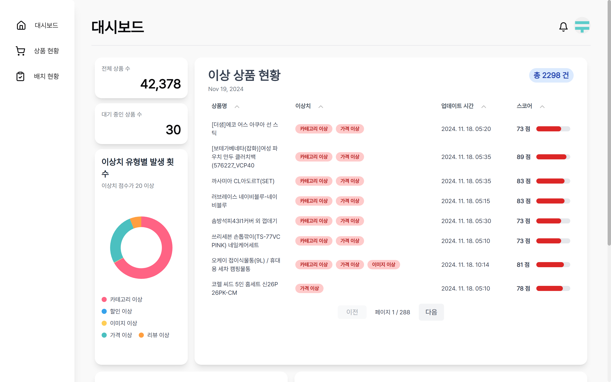
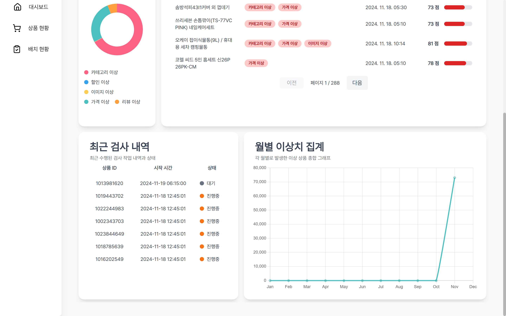
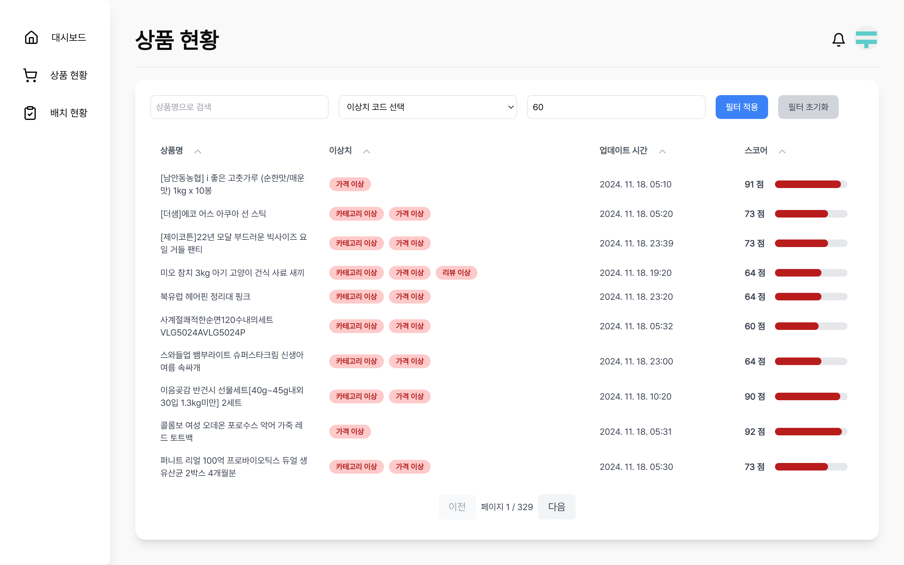
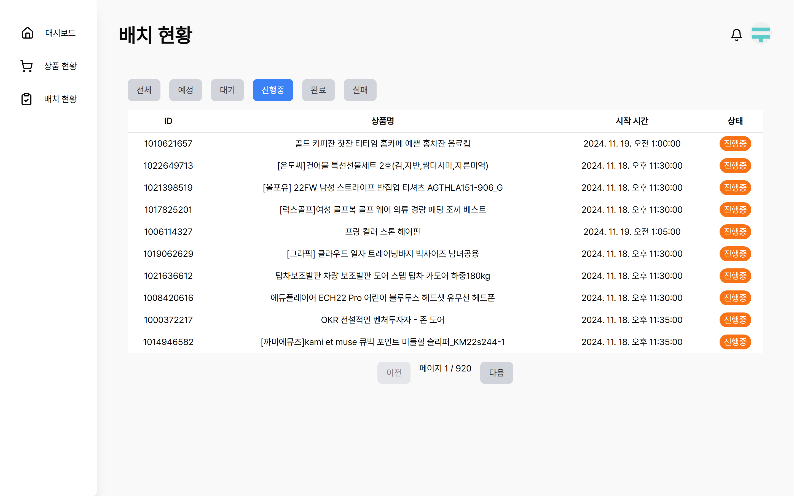
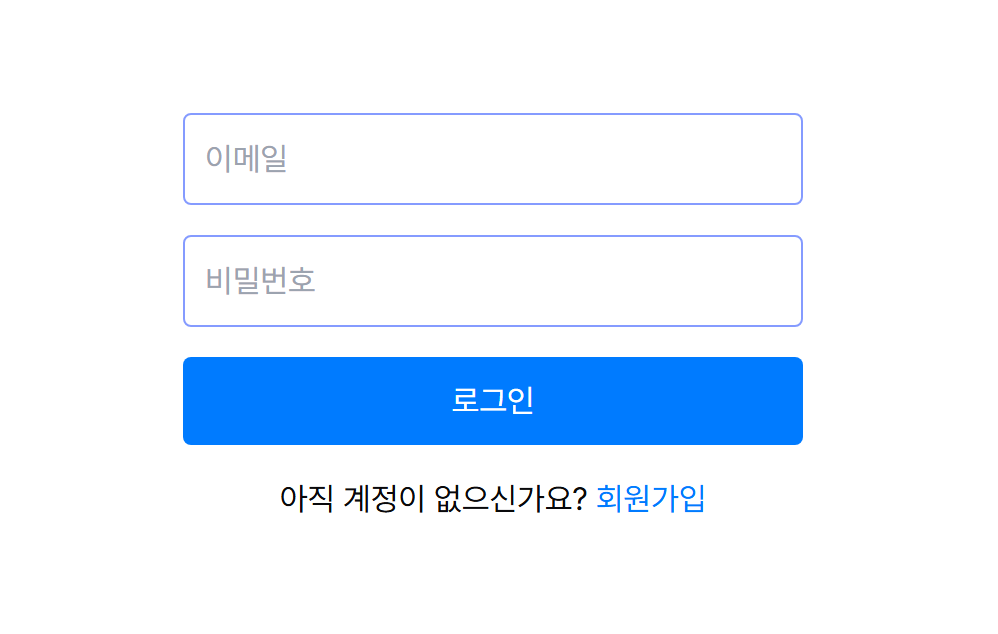
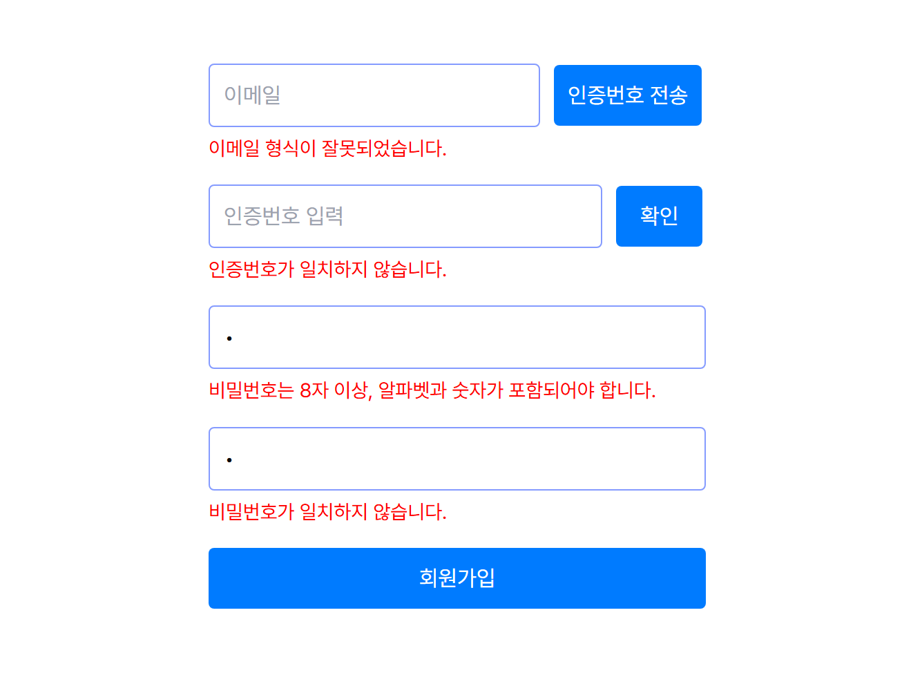
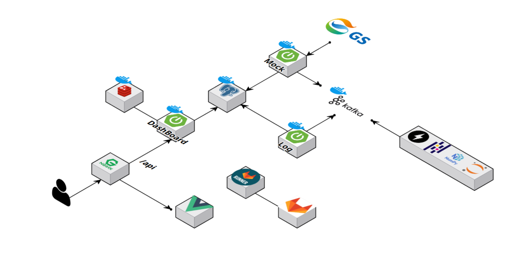
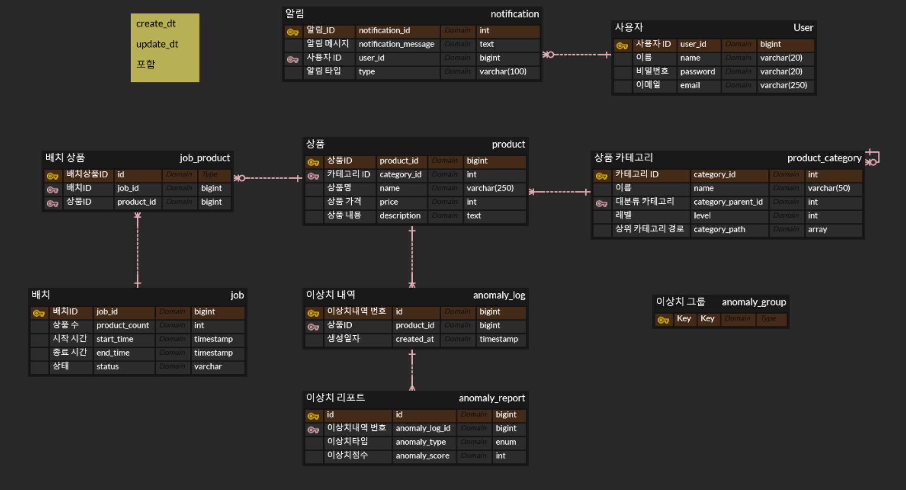
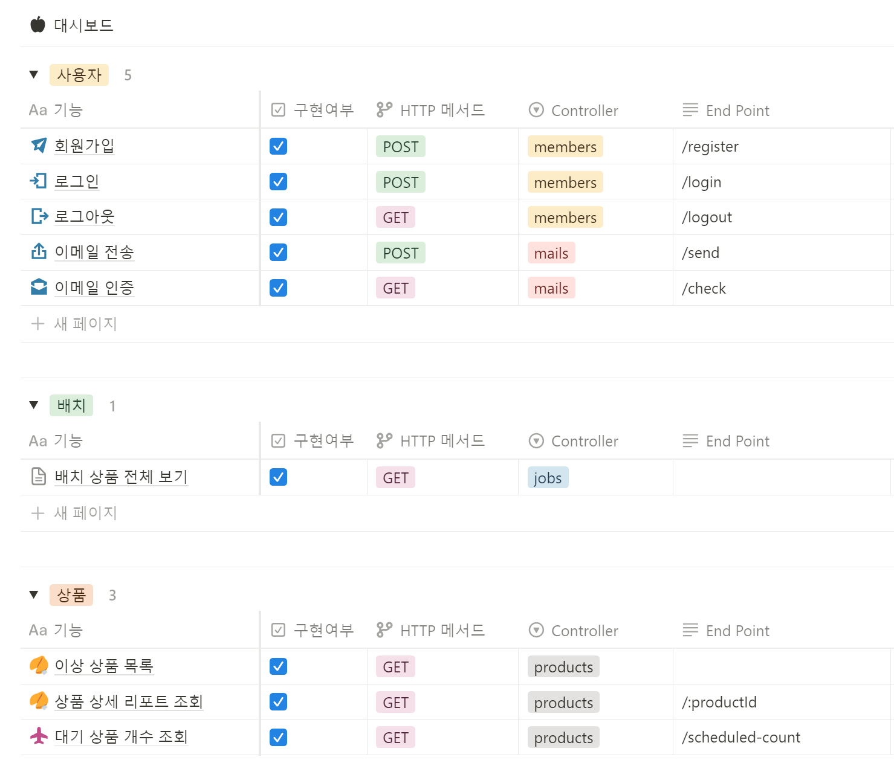

# GS리테일 이상 상품 탐지 및 관리 시스템 PADS

## 목차

1. [개요](#개요)
2. [핵심 기능 소개](#핵심-기능-소개)
3. [서비스 소개](#서비스-소개)
4. [프로젝트 설계](#프로젝트-설계)
5. [팀원 소개](#팀원-소개)

## [개요](#목차)
> 개발 기간 : 2024-10-14 ~ 2024-11-19

**PADS란?**

Product Anomaly Detection System의 줄임말으로, E-commerce에서의 이상 상품을 자동으로 탐지하여 줄임으로써 사용자의 신뢰도와 경험 향상시키는 시스템

## [핵심 기능 소개](#목차)

### [PADS PPT 발표 자료](resources/pdf/ppt.pdf)

### 핵심 기능
1. 이상 상품 탐지
- 상품 정보 분석을 통해 카테고리, 가격, 리뷰 등에서 이상치를 자동으로 탐지
- 이상 상품을 탐지하여 사용자 신뢰도 및 경험 향상

2. 이상치 스코어링
- 탐지된 이상 상품에 대해 이상치 점수를 부여
- 점수를 기준으로 상품의 이상 정도를 판단하고, 관리자가 우선적으로 확인 가능

3. 대시보드 기능
- 관리자용 페이지에서 이상 상품 및 탐지 결과를 직관적으로 시각화
- 주요 기능:
  - 이상치 점수가 높은 상품 리스트화
  - 월별 이상 상품 통계 
  - 이상 탐지 기준별 빈도 분석 
  - 최근 탐지 내역

### 이상 탐지 기준
**1. 카테고리 이상**
- 상품과 카테고리가 어울리지 않는 경우
- 일부 샘플 데이터에 직접 라벨링을 진행
- 지도 학습된 모델 KLUE-BERT 기반으로 카테고리와 상품명 매칭 점수 계산

**2. 할인 이상**
- 할인된 가격이 기존 가격보다 높은 경우
- 단순 룰베이스 기반
- 0점 또는 100점으로 이상치 부여

**3. 이미지 이상**
- 이미지가 누락된 경우
- 단순 룰베이스 기반
- 0점 또는 100점으로 이상치 부여

**4. 가격 이상**
- 카테고리, 브랜드, 공급자 속성별 가격이 평균에서 크게 벗어난 경우
- Z-score 기반 이상치 탐지 및 지수 함수로 보정하여 점수화

**5. 리뷰 이상**
- 리뷰 수는 많지만 점수가 낮은 상품
- 리뷰 수와 점수의 스케일 차이를 보정하기 위해 지수함수를 적용해 이상 점수 계산

### 종합 점수 로직
- 각 이상치 기준 점수를 기반으로 종합 점수를 계산하는 수식 설계
- 제곱평균을 활용해 특정 기준에서 명확히 이상으로 판단될 경우 이를 반영해 높은 점수 도출

## [서비스 소개](#목차)

### 대시보드

- - -
### 상품 현황

- - -
### 배치 현황

- - -
### 회원 / 로그인

## [프로젝트 설계](#목차)

### 시스템 아키텍쳐

### ERD

### API 명세서

## [팀원 소개](#목차)

